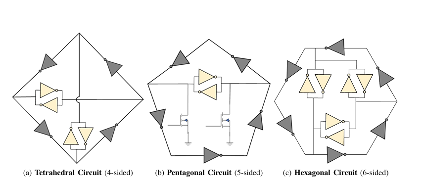

# 🔐 True Random Number Generator (TRNG) Using Ring Oscillator

  
  
  
  

---

## ✨ Abstract
This project presents a **hardware-efficient True Random Number Generator (TRNG)** using CMOS transistors. The TRNG uses a high-speed **Ring Oscillator (RO)** as the entropy source, where **timing jitter** from thermal and flicker noise generates randomness.  

A **D-Flip Flop (DFF)** samples the jittered signal, exploiting **metastability** to produce unpredictable digital bits. **Transient simulations** in Cadence Virtuoso (gpdk90) confirm an **aperiodic, unpredictable output sequence**.  

The design includes **schematic capture, custom layout, DRC & LVS verification**, and **post-layout simulation** to assess parasitic effects. This TRNG is suitable for **cryptographic systems, secure key generation, and other applications requiring true randomness**.
  

✅ **Randomness Source:** Timing jitter & metastability  
✅ **Digital Conversion:** D flip-flop sampling  
✅ **Output:** High-quality digital bitstream  

---

## 1️⃣ Introduction
<table>
  <tr>
    <td width="60%">
      <h3>True Random Number Generator (TRNG)</h3>
      

       With growing dependence on digital systems, security and trust have become critical in electronic design. Cryptographic mechanisms rely on **high-quality random numbers** for encryption keys and authentication, and weak or predictable randomness can compromise system security.  
      

    </td>
    <td width="40%">
      
    </td>
  </tr>
</table>

Random number generators are broadly classified into **Pseudo-Random Number Generators (PRNGs)** and **True Random Number Generators (TRNGs)**. While PRNGs are algorithmic and predictable if their internal state or seed is exposed, TRNGs extract randomness from **physical processes**, providing inherently unpredictable outputs suitable for secure hardware applications.  

Among hardware-based TRNGs, **Ring Oscillator (RO) designs** are popular due to their simplicity, low area, and compatibility with standard CMOS technology. ROs exploit natural variations like **phase noise and jitter** as entropy sources.  

This project focuses on the **design and implementation of a high-gain RO-based TRNG**, covering:  
- Transistor-level RO design and simulation  
- Integration with a **D-Flip-Flop (DFF)** and stable reference clock  
- Analysis of the output bitstream for randomness  
- Full-custom **DRC- and LVS-clean layout**, ready for fabrication  

The design follows concepts from the reference paper:  
*S. Williams et al., “A Novel Pentagonal Ring Oscillator as a True Random Number Generator,” 2025 IEEE 18th Dallas Circuits and Systems Conference (DCAS), pp. 1–5.*

---
## 2️⃣ Working Principle
- 🔁 **Ring Oscillator:** Generates oscillations (odd number of inverters)  
- ⏱️ **Timing jitter & metastability:** Introduces randomness  
- 🖲️ **D Flip-Flop Sampling:** Converts analog uncertainty → digital bits  

📌 **Diagram Placeholder:**  
  

---

## 3️⃣ Architectural Overview

This project develops and evaluates **Ring Oscillator (RO) architectures** for a True Random Number Generator (TRNG) using CMOS technology. The main goal is to generate **high-quality random bits** by exploiting **timing jitter, metastability, and noise** in oscillators.

### 1. CMOS Inverter Design
- A **basic CMOS inverter** was designed and optimized for balanced rise/fall times and robust switching.
- This inverter forms the building block for all ring oscillator stages.
- Verified via **schematic, layout, and transient simulations**.

### 2. Ring Oscillator (RO) Architectures
Different RO geometries were explored to maximize randomness:
#### 2.1 Tetrahedral RO
- 8 inverters arranged in a tetrahedral structure with **4 unstable loops** and **3 stable loops**.
- Produces randomness through **jitter accumulation** across multiple loops.
- Medium efficiency in area and power.

#### 2.2 Pentagonal RO (PRO)
- 7 inverters arranged in a pentagon; two inverters with NMOS create a **metastability core**.
- Combines **startup metastability + oscillation jitter** for strong entropy.
- High efficiency in area, power, and random bit generation.

#### 2.3 Hexagonal RO
- 12 inverters in a hexagonal layout; 15 loops (8 unstable, 7 stable).
- High complexity and large area; lower frequency and higher power than PRO.
- Useful for research but less efficient for practical TRNGs.

#### Comparative Summary
| Type | Inverters | Key Entropy Source | Efficiency |
|------|-----------|------------------|------------|
| Tetrahedral | 8 | Multi-loop jitter | Medium |
| Pentagonal | 7 | Metastability + jitter | High |
| Hexagonal | 12 | Extensive-loop jitter | Low |

### 3. Advanced RO Variants
- **Current-Starved RO (CSRO):** Adds series NMOS/PMOS to limit currents, enabling tunable oscillation frequency and lower harmonic distortion. Ideal for **low-noise, low-power TRNGs**.
- **Dynamic CMOS Inverter RO:** Uses clocked precharge/evaluate phases to increase frequency and pseudo-randomness while reducing transistor count. Verified through **layout, RC extraction, LVS, and DRC**.
  <table>
  <tr>
    <td></td>
    <td></td>
    <td></td>
  </tr>
</table>

### 4. Sampling & TRNG Mechanism
- The oscillator output is sampled via a **D-Flip-Flop (DFF)**.
- Randomness arises from **timing jitter, metastability, and thermal/device-level noise**.
- Generates **unpredictable digital bitstreams** suitable for secure applications.

This modular design approach allows evaluation of **area, power, stability, and randomness** across multiple RO topologies, highlighting the **Pentagonal RO** as the most practical for TRNG implementation.

---

## 4️⃣ Results

### 1. Ring Oscillator Performance
- **Tetrahedral, Pentagonal, Hexagonal ROs** were analyzed for **frequency, THD, power, and jitter** with varying supply voltage (VDD).  
- **Dynamic CMOS RO** showed the **highest oscillation frequency** due to its precharge–evaluate mechanism.  
- **Pentagonal RO (PRO)** had **moderate frequency** but strong entropy due to **metastability + jitter**.  
- **Current-Starved RO (CSRO)** offered **low frequency**, **low noise**, and **higher delays**, highlighting a **power-performance trade-off**.

### 2. Power & Efficiency
- **Average Power (low → high):** Dynamic CMOS < Tetrahedral < Pentagonal < Hexagonal < Current-Starved.  
- **THD (signal distortion):** Tetrahedral highest (unstable), followed by Dynamic CMOS, Hexagonal, Pentagonal, and Current-Starved.

### 3. Randomness
- Dynamic CMOS and Pentagonal ROs produced **high-quality random bitstreams** when sampled by D-Flip-Flops.  
- Dynamic CMOS RO had **higher noise**, which increases entropy for TRNG applications.

---

## 5️⃣ Conclusion

- **Geometric Topology:** Pentagonal RO strikes the **best balance** between area, efficiency, and entropy, outperforming tetrahedral and hexagonal designs.  
- **Current-Starved RO:** Ideal for **low-power, secure systems** with tunable frequency and noise reduction, but lower oscillation speed.  
- **Dynamic CMOS RO:** Offers **highest frequency and low power**, making it excellent for **high-entropy random number generation**, despite higher noise sensitivity.  
- **Physical Implementation:** Full-custom layouts passed **DRC and LVS checks**, confirming readiness for fabrication.  
- **Takeaway:** Pentagonal and Dynamic CMOS architectures are most suitable for **practical, high-quality TRNGs**, balancing randomness, performance, and efficiency.

## Bibliography

1. S. Williams, P. Kirtonia, S. Akter, K. Khalil, and M. Bayoumi, “A Novel Pentagonal Ring Oscillator as a True Random Number Generator,” in 2025 IEEE 18th Dallas Circuits and Systems Conference (DCAS), 2025, pp. 1–5.  
2. M. Z. Jahangir and C. S. Paidimarry, “Design of a Novel Charge Pump based Current Starved Ring Oscillator with Reduced Phase Noise,” in 2023 International Conference for Advancement in Technology (ICONAT), Goa, India, Jan. 2023, pp. 1–4.  
3. D. Liu, Z. Liu, L. Li, and X. Zou, “A Low-Cost Low-Power Ring Oscillator-Based Truly Random Number Generator for Encryption on Smart Cards,” IEEE Transactions on Circuits and Systems II: Express Briefs, vol. 63, no. 6, pp. 608–612, June 2016.  
4. J. A. Aguilar Angulo, E. Kussener, H. Barthelemy, and B. Duval, “A New Oscillator-Based Random Number Generator,” in 2012 International Conference on Synthesis, Modeling, Analysis and Simulation Methods and Applications to Circuit Design (SMACD), Seville, Spain, 2012, pp. 126–129.  
5. H. Rohail and R. Ramzan, “A High Throughput True Random Number Generator using Metastability and Chaos,” in 2022 20th IEEE Interregional NEWCAS Conference (NEWCAS), Quebec City, QC, Canada, 2022, pp. 1–5.  
6. S. G. Mehraban, M. Jalali, and M. Azadbakht, “True Random Number Generator Relying on Multiple Entropy Source and Triple Oscillator for Cryptographic Purposes,” in 2024 32nd International Conference on Electrical Engineering (ICEE), 2024.  
7. Y. Uwate and Y. Nishio, “Synchronization in Several Types of Coupled Polygonal Oscillatory Networks,” IEEE Transactions on Circuits and Systems I: Regular Papers, vol. 59, no. 5, pp. 1042–1050, May 2012.  
8. H. Martin, P. Peris-Lopez, J. E. Tapiador, and E. S. Millan, “A New TRNG Based on Coherent Sampling With Self-Timed Rings,” IEEE Transactions on Industrial Informatics, vol. 12, no. 1, pp. 91–100, Feb. 2016.  
9. G. Matos, P. Correia, J. Rocha, J. Casaleiro, and L. Oliveira, “Performance evaluation of TRNG based on Ring Oscillators implemented on FPGA,” in 2023 7th International Young Engineers Forum (YEF-ECE), 2023, pp. 118–121.  
10. D. Khurge, H. Khairnar, S. Bhandari, Y. Meshram, G. Joshi, and G. Patil, “Modelling and Synthesis of a Ring Oscillator Based True Random Number Generator using Open-Source EDA Tools,” in 2024 2nd International Conference on Emerging Trends in Engineering and Medical Sciences (ICETEMS), 2024, pp. 453–456.  
11. P. Monteiro, L. Oliveira, and J. Casaleiro, “True Random Number Generator Implemented in 130 nm CMOS Nanotechnology,” in 2022 International Young Engineers Forum (YEF-ECE), 2022, pp. 52–56.  
12. S. Suman, M. Bhardwaj, and B. P. Singh, “An Improved Performance Ring Oscillator Design,” in 2012 Second International Conference on Advanced Computing & Communication Technologies, 2012, pp. 236–239.  
13. N. A. N. Hashim, J. T. H. Loong, and F. A. Hamid, “Inverters with Different Loads for Ring Oscillators True Random Number Generator Analysis,” in 2019 IEEE Regional Symposium on Micro and Nanoelectronics (RSM), 2019, pp. 153–155.  
14. S. Robson, “A Ring Oscillator Based Truly Random Number Generator,” M.A.Sc. thesis, Dept. Elect. Comput. Eng., Univ. Waterloo, Waterloo, ON, Canada, 2013.  
15. J. Dix, “Low-Power, High-Speed Adder Circuit Utilizing [incomplete reference].”  
